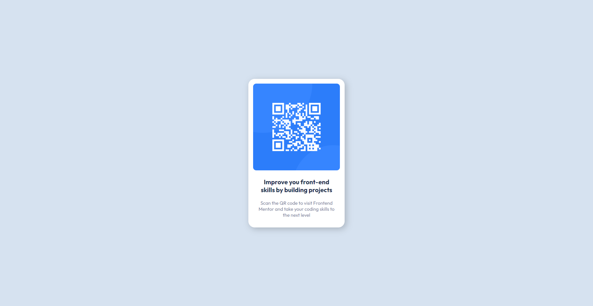

# Frontend Mentor - QR code component solution

This is a solution to the [QR code component challenge on Frontend Mentor](https://www.frontendmentor.io/challenges/qr-code-component-iux_sIO_H). Frontend Mentor challenges help you improve your coding skills by building realistic projects. 

## Overview

### Screenshot

## My process

### Built with

- flexbox
### What I learned

Nothing much, I just needed to remember what I learned.

## Acknowledgments

One wbesite that helped me understand flexbox is 